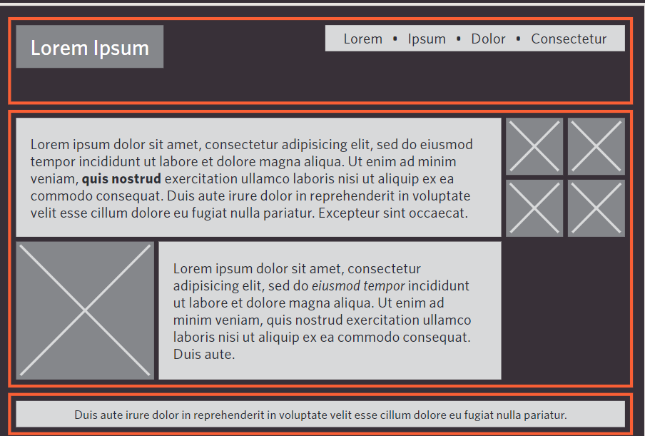

# Building Blocks
BlocksCSS treats each HTML element as if it is in its own box. This box will either be a block-levelbox or an inline box.Block-level boxes start on a new line and act as the main building blocks of any layout, while inline boxes flow between surrounding text. You can control how much space each box takes up by setting the width of the boxes (and sometimes the height, too). To separate boxes, you can use borders, margins, padding, and background colors. 
#### **Block-level elements:**
start on a new lineExamples include:
* (h1) 
* (p) 
* (ul) 
* (li)

#### **inline elements:**
 flow in Between surrounding textExamples include:
 * (img) 
 * (b)
 * (i)

 ## **containing ElEmEnts** 
 If one block-level element sits inside another block-level element then the outer box is known as the containing or parent element.It is common to group a number of elements together inside a (div) (or other block-level) element. For example, you might group together all of the elements that form the header of a site (such as the logo and the main navigation). The (div) element that contains this group of elements is then referred to as the containing element.

 

 ## **ControLLing the position of eLements**
 CSS has the following **positioning schemes** that allow you to control the layout of a page: normal flow, relative positioning, and absolute positioning. You specify the positioning scheme using the positionproperty in CSS. You can also float elements using the float property.

 ### **normal flow**
 Every block-level element appears on a new line, causing each item to appear lower down the page than the previous one. Even if you specify the width of the boxes and there is space for two elements to sit side-by-side, they will not appear next to each other. This is the default behavior (unless you tell the browser to do something else).

 ### **relative Positioning**
 This moves an element from the position it would be in normal flow, shifting it to the top, right, bottom, or left of where it would have been placed. This does not affect the position of surrounding elements; they stay in the position they would be in in normal flow
 ### **aB solute Positioning**
 This positions the element in relation to its containing element. It is taken out of normal flow, meaning that it does not affect the position of any surrounding elements (as they simply ignore the space it would have taken up). Absolutely positioned elements move as users scroll up and down the page.

 ## normaL fLow **position:static**

 In normal flow, each block-level element sits on top of the next one. Since this is the default way in which browsers treat HTML elements, you do not need a CSS property to indicate that elements should appear in normal flow, but the syntax would be:

 **position: static;**
 
  I have not specified a widthproperty for the heading element, so you can see how it stretches the width of the entire browser window by default.

## reLative positioning **position:relative**
Relative positioning moves an element in relation to where it would have been in normal flow.

For example, you can move it 10 pixels lower than it would have been in normal flow or 20% to the right.You can indicate that an element should be relatively positioned using the position property with a value of relative.

![img](data:image/png;base64,iVBORw0KGgoAAAANSUhEUgAAAQYAAADBCAMAAAAace62AAAA7VBMVEX///8AAABYWFgaGhrtaSntbTHsYhc2NjbsZiL87OdGRkb2wrHtay374drxlXP4nXz39/eTm534zb//2cwcJinpSwzl5eVMTEzzqprt7e3ExMR/f38sLCyLi4sTExNcXFx3d3efn5/U1NTc3Ny3t7c+Pj73xbzrWS3oPAD98/FsbGwhISHrXjaqqqpBQUFTLyARGBqTQRlFGACqY0h3XFOgp6nypY28vLztdUlmZmaSkpLpSADvg1gAFRqZSiftelXtakLvimXqUR7tckvzrJH0tKLsb0LrYDL1tan2ybXsa0rteVcADRIAIynrVgBP/ixiAAAG6ElEQVR4nO2dC1PiSBRG0wGGEXlkQcIGIm8GAXGeoqAOiKM4urv//+ds95eOOtYML8Or6jtVojd2oHPS6b4W4WoYhBBCyFzEw/H18G5v04c6jUgkEl4D8ciWa4ifJ9fA5baPhnByHS+Tfv+utY7XWZZIOPWXCIWKJ44XOzIAtm6gY1HVcbToxWc6Lum4ouOCt4M4fH4NR1x9j8Q/fgptlOLJLA0S90mDpuZr0PgaQjqu69jU8bMGj8JLDeJzJPJFbJjoTA2m2dYarJjp4Y8GHed8LX0d5/3D1rGvpZLz4srzazgx82s8/M3cJKXQHBqmNAiG/Y3PDbk5NFir7oTUsOGVIjZLw1m5TQ3rWTCpAVAD2AEN1UplSoNg2H4NXCkMatDIi6LW7a68EzugYR2doAZADYAaADUAagA7oKFWr09pEAzbr4Hpk0ENGmoA1ACoAVADoAYg8wanVpvSIBh2QMM6OkENgBoANQBqANQAtl9DKl8oMG9g+qSgBkANgBoANQBqAFLDqduhhnDScuwpDYJhBzSsoxPUAKgBUAOgBkANYPs1pE4bUeYNzCIV1ACoAVADoAZADUBqqPdL1CDTJ2vlFnZCwxqgBkANgBoANQBqANuvITVg+sQs0oMaADUAagDUAKgBqFvADnkL2NT0qZVIJGZWpmkl5jjAXdaQGWaPLi5ndf/D0d+zO7HDGjLN0X7iZ2/WcPiQDUiDVV3lBxqW1nA9/jnP8wemwRaN3212KvnfbV6UpTWEm3M9f4Aacr/bnBduEHfjLK0hu3ENVTUO7H4liIVsyQ8Z9ZrN5rFkJGWcNzNyS+JmKA9lrzeaXCfQpPXj7vg8vToNZy/LDL6VJdOnn9JDT9LMGka6OZQTZfJiX1q4m9ze30FLa5g97yXHw/GqNOTFYPYzz8vSWaR3UWSlBuNHtmekx/Lyad3cqBFxc6O0yI1yjDSX05AXZ3ZO1eTLm0X3UNUn9DTYg1ioU6rKKyJaFMWOqOXlmKh2cpgfuhgfdqETKlVfv8QMgtBg3I0zjyN5IJmLWxXejtNG4vgOa2lvWQ0DV5UmrIhStyxMx9cgfy6UVHlK+9AUJ4W2nRcFwzK9epUN9c12i4NKSCy4fgSiITOZYPlMZRN7ktvxvrE/7qHZknNDXoRMx5LXf9lQZ3nga3DUwDgT6o20Os690iBlqTKcWFKdhltTLha8NyUQDUayGVffLpsXR5KLo3vjPnuP3yytAetgO4T5ueNav8wNuY7tT5HQYKGmZUV0VYyiZZWnMq7zEYiGdHMkB4DUkN1rAcvY14e/tIayfLSjpu04jtUQTxqcbr8hL5dfNRgleRFYpU5NXTVVuYcDJQsQhIbWZJK4OZbL5G32KbPMTM7fNjeU5WPtqdKrr6FeFKVBN/pag3qsYZeYv8dileyWLmryQkNPTonp8aVcIyYjrJVKwDUmh/T4bRr6lgP03FAVbtVShXpfaXAaUWeAaTEmbG+PYOeGP2aRF9BwcaHGgGqUVKtEepy9TKWG1zLeG2XPU5fj3uQNGpxc1PG3QEPXO8k5peHFFGkYh6LmdtQPA7FUKZqlNYwe8DgyWg8jdfb3Hh8TKoscPtwk0+pXrR/Dh2Qi8Xg/uxN/0iBnur46q+pLayhbhtXF3JAXai3RGqqi7RmqeeNl0bsRtvRdK63B6AvRL/c7da3BaYhYudHB3OBERSNmaw2GK4peylQXIlcun5iL9WBLNVSL3h8MVt10O42CSgWKJRnbbdctOIdFtZpWc65b8xt2Q2W9a60c7bilBS+NLdWwbqgBzLFgsmwm36cA1ACoAVADoAZADYAaAKuAAWaRgBoANQBqANQAqAGgCliZeQPTJwU1AGoA1ACoAVADUNU8oi41qCpgzpQGwbADGtbRCWoA1ACoAVADoAaw/Rpk3sDqocwiATUAagDUAKgBUANgFTDAKmCAWSSgBkANgBoANQBqAKwCBphFAmoA1ACoAVADoAaAKmCH1MD0SUENgBoANQBqANQA8CGjRWsoLc72a2D6ZFCDhhoANQBqANQAqAHIvME+W6zI3DLsgIZ1dIIaADUAagDUAKgB7ICGapdVwJg+AU/DyjshNcz8fx+rJTeHBtNsv/j0XcEEOb8iY0XHfg3bbs7b4JdGz+vY/98vNR37z+nEzK/x8Ddzk5RCc2gQwn2hIfeqdG9ZxwVfi47b+rDrOjZ1XNWxXybWEeJzJPJFbJhZHyu5Ojg4iL3Q0D8AV6c6PrzyYv/sn3rxJ1/L2T9e3H/S4D1B7knDv98j8Y+fQhuleDJNQ/wyA9LPZDK/bsr8acP8cS+86blhOpFI/P0aCEc2vVJM5926+G+rNSTWxqaPlBBCCFmc/wGRuuMweOmwtAAAAABJRU5ErkJggg==)

## absoLute positioning **position:absolute**

When the position property is given a value of absolute, the box is taken out of normal flow and no longer affects the position of other elements on the page. (They act like it is not there.)

The box offset properties (topor bottom and left or right) specify where the element should appear in relation to its containing element.
## fixed positioning **position:fixed**

Fixed positioning is a type of absolute positioning that requires the position property to have a value of fixed.

It positions the element in relation to the browser window. Therefore, when a user scrolls down the page, it stays in the exact same place. It is a good idea to try this example in your browser to see the effect.

## over  Lapping eLements **z-index**

When you use relative, fixed, or absolute positioning, boxes can overlap. If boxes do overlap, the elements that appear later in the HTML code sit on top of those that are earlier in the page. 

If you want to control which element sits on top, you can use the z-index property. Its value is a number, and the higher the number the closer that element is to the front. For example, an element with a z-index of 10will appear over the top of one with a z-index of 5.

## fLoating eLements  **float**

The float property allows you to take an element in normal flow and place it as far to the left or right of the containing element as possible.

**Anything else that sits inside the containing element will flow around the element that is floated.**

![float](data:image/png;base64,iVBORw0KGgoAAAANSUhEUgAAAT4AAACfCAMAAABX0UX9AAAA9lBMVEX/////77MyMjLGxsZ+fn7Y2NiBgYH/7q+ioqJtbW3c3Nybm5uTk5P5+fng4OCNjY2srKzr6+sZGRkiIiKlpaVlZWX/++3ExMTn5+fNzc3//PL//vj/87a2trb/97kAAAAqKirv4KhWVlbe0JzNwJD56a9fX191dXVFRUV/d1mUi2iqn3fo2aPCtoj/8sKNhGP//79ZUz6xpnx5cVX/9dE/Pz/EuIoeHBU7NylnYUhMRzUuKyCflXD/+eL/8btSTTr/9MomJBva1sjEwK8TExP/+93o3rvu4bHXzanv5sKnoYvTxIt1c2ttZ002MiZCPi6jn5SJhnm6gaERAAAM9klEQVR4nO2dC0OqyB7ABx8pKYqZRzkNIwj4AAzFrDR6nXV376u69/t/mTuAntAMlcHUnN9uioAy/M48efwBgEKhUCjxcPHzByk/L+JNUiEdK6UPGxCz5/x5Njv3GolfVw9MhhTm4elX5BRk0wv7xhWlszgpt4VFeynhvJ0SkkK+nReSSbYhJiNRVWGGiYMMVP6IloRkssHN7xw/ScSL1F7IfylQqAjFPBBbaTYJUtkPSViP+wcYizwXCP+MkgRMsTD/uSWFuojg72whg5+APM6QLGjVQC2F34HIR7EXmzuPzP2W9AU/t5uNzT1+1MfzgGsC9hSkU6ANQL66ebJ/xmsvsr8wfU1BqJwLqWK6xQsVPL/MA9ZfnBUENro+LsU206DUZJslkGyyJxGSfRlPtRfgIVILHKbvTAT1FhiK7Fmh4c4ui4UzP+9VQK4cImyFPlASCqVSqZau4ddTd3FpQ+4D9jQGQai5MBB/WAqEEKHFedpc5Zm52iwJq/VJeVBuctWTspiSMAmJK5a9xWWea7oT0lmj7S1IeC/uK/6ThLYUqi/ZbLmwDe+tcQryFX+qmWqtBWsG9lzvdCxDt6zOoywPOsv12R29Y82rhd0XZ77xYdfbuE/lfLW+Fmi0S8lJqlous9VqIlU6SWY9bac1zyIr1viGgLseUqOaTJUbgiiJOTYNqsNQfcVT/MaBEg/cf0PhnGv5S/hktllZpxm+CO41MicqwsiPCOnGQnMM/c9IrTvzuQ8aqmnMzcr8WGPL7zRX62uAVgWIw2riLFtguUa1VBFLrpk2yOKyK+XSFdDMlqqtwhDk2FIjD/gGYBO13FznZ4m+NOB4CdTOQaNYAgKP9XFCigN8Mwtq7Br+gmWXgWpd8SRpUOvLC/ZMZ7aOOi9WGSEG2UpQ39Um9rjKSn2JdqkqFgSRLTc4scomQFYqJd0mJA9wXSixYFgtnSV44TxfrUliLVEEbaE0wbOllfpSbdbV12Irvr4Cm6gCPoFzY/PjMGWlPrdYyjKE1y/IreYCOdPqQL+k1gOm8Cyk27jCnMzpe4pbXyINKjxuJaQiaA3bLZDIut4SUromnQ1z6WSFO2+c8UK1XRCHHF8+FVslviGmK+2V+oB45hbeRhb4+nB2xIW32CqI67TDV0F9yLnr4bKrqxCN8Z/iyH6pRTKDlBu/fUDO7fv6isHA3q2JoDHqbVWflBYnuZqX0QrZYROIabfFaONumyhyLU444cTmGc+lyryQFs4aXLLFJduc0FrR8uarXAn/l855bzzPVQSPk1xOagirSf4VLIbo5RU3HHpdhkpfQ05fHmluljRGb9AZv+leoUWj/qyeQ9cvXaPbv7O61s3ACTYnf6+x6d9U19FXwbIaXi3YcF+afnd5OBy220OpPUw0cOMrCpK7HC9puP/j2dIKfbXUiUuq5b2dcOCU9xBd+DX4R7AeQ286zn29vowcB6k3Zu/OhNCytRcLoZGK/Nx305npM/uMYfeMTg8pfTjXdvy9zqZ/U/N2Jh9aeFcNLqQhOxQa4Wst6ivmcvNHLXKLM1aRm9PXq3fdj4oGb2TmzkGwLqNRF6EbBamPcLaOPZ1CA9vuM4xbzAf2fGvy92aJ8GhsNOb9oK8FkuyKb3zIfafEB8H+GdxrZdrwwu4AKXUGGWPGwBnP6TOuxWmWq5v+BIR1Xe0xWh031Hfz/WbmcvOEnLYW9KU2OyogtaVVXyh/HHWQEmw6oDprP0eqovehdmtrYw2XYoPRXk171vDK/oQ8GiDUhd0RAx1HCTa8GzYdUxbrPqEc5ahKmL3FjlwM+p4C+pD96uci5e1aNZyecYuUcc92bgzZ6eieNYicZw26mKOXATKuUcdA2rNtLIzaIqRkUR+otstxIrUW+3Ex6Ht432nV7oz1rutIf1OhjAdnGjTrI7V7pzBvHU8sVPXxm6XrncFd/U67HdtIfjOh4leZAX1Rjvl90Ld1YtAXPGAga5ose1OuK012O8V40v0kT3vQMl4Hr+TiLYDKG3IHKcy8vs0GbT6HqO8n4dEqZC20uR4PUZJyiPruSfRBBLXRkuNa0Y6XHqK+KwJ9UL1VHfNj5stcRkrKIeojOtSs2ba87CTTz0hJOUB9Fw9L9n595g7JTMlkotk7RH0/Yj/PkbmMaO8Q9f0Zr75M5uE+8oUaB6gvOOYgvkYj8/AUXd5B6gtUfZnLKH3dGDk8fT/e5T1EvDYgPg5P3+9Oc/QKPz4OT9+s6os0xI+bw9M3K7g7rvV8Dk7fhZf54GXMF4VGZL/0ZdlVVP7ljRnsSthKp96PlZorf20dimE7s1/6UqtTc5VhMkx4weWTGyYpOgen7xJXeytaXKrvUy4ymZXVHtX3Kfdr9Feovk+5WmOgQfV9yjoDDaqPiKk+7nyji1Y+Qwzb1HfWV416s8sci7f1zPGN9X0FVB8RVB8RVB8RVB8R31lfbdOblcLuH1rON9bHTa+dJiOVC9vUN9b3FVB9RFB9RFB9RFB9RFB9RHxjfaVWKg7yYZv6xvq+AqqPCKqPCKqPCKqPCKqPiG+sj8udx0D2eM+0xQI907Y9qD4iqL5FLjYA5AvL5m6TfdZ3cf+02Z02cGk41KstXne9x/ruHzKx3PCVYbZ3u87+6nuK72a5zNZum/i6jkuquAkn/44vliwTMTDHGuxr7nuK1d7WbtvZU31EARKWs5X6bz/1vd+iDhFCbqhT5EY7RZ9kSbwCXuXDwrmYYhHDI6wgVF8tji1E0ff7Hmto6rpu2/hloDPyYDGap4/m6I6hDww/Iociz75rD+TgatvIfmH6WukYrknhchH0XQbc6BPFjZhjdyDTv14eDJWx6rJsvg284IATfZrpYPfWX+y/bqX1CNPHx3JyJ0oVEIyKpY/d/YeaCeHdQsQXaPoxUJE1hhBeeyE94fUssAnqTOPrdP1MuI3SG0MQpvXY4J62yn8ClRbqDFwp2AB0dMjMBd5AfT9aMRrgjAeNZ5mZhebw/iamOw2Vum89s4W9+jJ9gFufYHQOre/0cOPRkRltbOL8pmh+qcVCNfPZDwSIRg4WNXFrRuiG0NIUU8Nlt8+Y7gfLYr6Bvg0I6pNv+7qlD96QGyoM2mPDzXDIdPQX2Rnf6l5J1cYGUvpuUYXX/ReE+kbfMpFl2ParpnbqA/to9UGz7obRNkcIDbrIrmtyH/dQdEd7NBDzLHu9FSjfjpx6xw28q6p9FXU6PQsvvTGUXt1E3cG0S3OU+vyaS+tC+VGWb2ykviIGi5RfZXQ9mkXzfFZ703Db3Tco46kRXvFGhTIW/KbA4y28sFvv+ZWdYfVs7Ex/7Ok6QjrOhCMVzRSruHa8dT0/YrP1njnxmhNkDHCRn/3UMepD1q3vqDcxFWuAmPo186ohta5qyhj6/Rao1t0qsO4g2H1kZNhRRio07/C8R1ySu7N+9Ffrq+Vzu+GP995Jrz/oefXb9airduye9QJtC9mdscO86NPHLiCljhteqN4oaKxajGw7uMdij3pIGSHzpmvvKPdxxDGJI/Ieh1xRb0ddN2vBDs5J15bxIiP7tdM1bhVtMpjGrrNfbnQVaurbo/M8MJFzh2WiR1W1LBkZk5m9aAEpCfTtjPcjpapimv4wQtGwE0X1spkGTfxJmXahtWvFVBQo41VVlUHo+rGuaxCPQFS34ZZnXfAvH7TtikBIQHeYERxowOnLbGTxeyW/ecHvqq4greNFhvZWev/yVx8y2BVzz0/ZEG3i2kQfj818/QGrXUEUUXHkeLGMlcX5kSIZr2Qf9RFFVESqpVvOh4CoUR/9toLQlvd0NzwR2Jsdn160t4NTRYVififIRPqWkNmWvX0svCQtx3J5uzlNviPmzrJtVA0ue6zew+WuLtLYEYEw5Bnm6uf6XPz315KZW03rHup77zRvGtBzvy5Q2w0Xv6OhMpt2NvZM3wanJ0LYMEWzTnOEWLL7pe+0WYmBZuj98x+Zdpqj9DX2S99u8J7AANGxPC1mXU5P1royLe8NGMz/fbY87OHV31mfmF/rkXC/Mu5TxkqfLD2thiX4W+sLvaPlN7jqC7sWrxYWOpfqw1VfaOz7AtUXxsVDeCTeA9IXzxGXIu//2nr67ldE4j0gfTF1m6f95jVz34rlh6QvVtas+1ZA9RFB9RFB9RFB9RFxQPpKsURaTvrP6zg+fbV4rpeaDvKPTl+8UH1EUH1EUH1EUH1EUH1EHJ2+QjwBH7P+rx2dvnih+oig+oig+oig+oig+og4On2FVByP2DjZ6EzbKg5IH1eLhekDXo5OX7xQfURQfURQfURQfUQcnb6SEAtHe6YtG0ugb3qmLQ6oPiKoPiKoPiKoPiKoPiKOTl8897RVpve0xaPvkO7r2PRmyNAfEdg4znq2zkM2tWf6Dg2qjwiqj4iv15f66g1uk6/XF/rkqUNDKO06BRQKZa/5P/55MxhyrbwrAAAAAElFTkSuQmCC)
