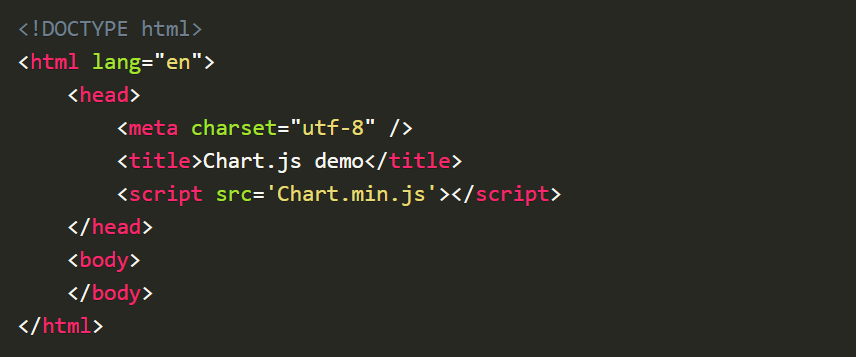

# Charts

Charts are far better for displaying data visually than tables and have the added benefit that no one is ever going to press-gang them into use as a layout tool. They’re easier to look at and convey data quickly, but they’re not always easy to create.

## Setting up

The first thing we need to do is [download Chart.js](https://github.com/chartjs/Chart.js). Copy the Chart.min.js out of the unzipped folder and into the directory you’ll be working in. Then create a new html page and import the script:

also , we can 
* **Drawing a line chart**
To draw a line chart, the first thing we need to do is create a canvas element in our HTML in which Chart.js can draw our chart. So add this to the body of our HTML page.

* **Drawing a pie chart**

* **Drawing a bar chart**

* **Conclusion**

You can view a [demo](https://www.webdesignerdepot.com/cdn-origin/uploads7/easily-create-stunning-animated-charts-with-chart-js/chartjs-demo.html) of this in action here.

### The great things about Chart.js
 are that it’s simple to use and really very flexible. Plus, once you’ve mastered the basics here, you’ll discover that there are tons of options listed in the [documentation](https://www.chartjs.org/docs/latest/).

