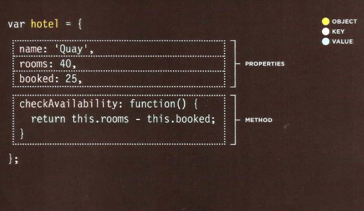

# WHAT IS AN OBJECT? 
WHAT IS AN OBJECT? Objects group together a set of variables and functions to create a model of a something you would recognize from the real world. In an object, variables and functions take on new names. 

IN AN OBJECT: VARIABLES BECOME KNOWN AS PROPERTIES If a variable is part of an object, it is called a **property:** Properties tell us about the object, such as the name of a hotel or the number of rooms it has. Each individual hotel might have a different name and a different number of rooms. @ FUNCTIONS, METHODS & OBJECTS IN AN OBJECT: FUNCTIONS BECOME KNOWN AS **METHODS:** If a function is part of an object, it is called a method. Methods represent tasks that are associated with the object. For example, you can check how many rooms are available by subtracting the number of booked rooms from t he total number of rooms.
## the ways you can create an object.

**In JavaScript:**
*  Variables have a name and you can assign them a value of a string, number, or Boolean. 
*  Arrays have a name and a group of values. ( Each item in an array is a name/value pair because it has an index number and a value.)
* Named functions have a name and value that is a set of statements to run if the function is called.
*  Objects consist of a set of name/value pairs (but the names are referred to as keys). 

### CREATING AN OBJECT: LITERAL NOTATION 
CREATING AN OBJECT: LITERAL NOTATION 
Literal notation is the easiest and most popular way to create objects. (There are several ways to create objects.) 
The object is the curly breaces and their
contents the object is stored in a variable called hotel1,
so you would refer to it as hotel object.
separat each key from its value using a colon separate each property and method with a comma(but not after the last value)

## accessing an object and Dot notation.
you access the properties or methods of an obect using **DOT** **(.)** YOU CAN ALSO ACCESS PROPERTIES USING square brackets.

## EX:
var hotelName = hotel .name;

var roomsFree = hotel.checkAvailability();

**while *hotel* is the object**

**and anything after the *DOT* is the methode name**  