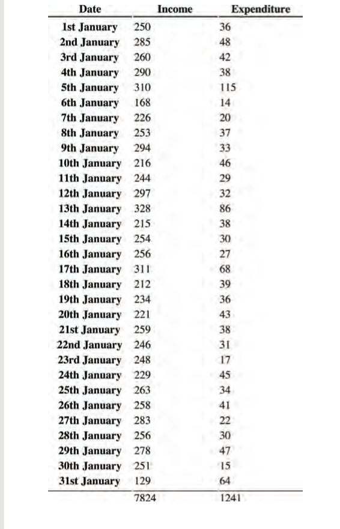

# Tables

**There are several types of information that need to be displayed in a grid or table. For example: sports results, stock reports, train timetables.When representing information in a table, you need to think in terms of a grid made up of rows and columns (a bit like a spreadsheet).**

## WhaT's a Table?
A table represents information in a grid format. Examples of tables include financial reports, TV schedules, and sports results.

Grids allow us to understand complex data by referencing information on two axes.Each block in the grid is referred to as a table cell. In HTML a table is written out row by row.

### basic Table structur

(table)The (table) element is used to create a table. The contents of the table are written out row by row.<tr>You indicate the start of each row using the opening (tr) tag. (The tr stands for table row.) It is followed by one or more (td) elements (one for each cell in that row). At the end of the row you use a  closing (/tr) tag.(td)Each cell of a table is represented using a (td) element. (The td stands for table data.)At the end of each cell you use a closing (/td) tag.Some browsers automatically draw lines around the table and/or the individual cells

## Table headings 

(th) The (th) element is used just like the  (td) element but its purpose is to represent the heading for either a column or a row. (The th stands for table heading.) Even if a cell has no content, you should still use a (td) or (th) element to represent the presence of an empty cell otherwise the table will not render correctly. (The first cell in the first row of this example shows an empty cell.)Using (th) elements for headings helps people who use screen readers, improves the ability for search engines to index your pages, and also enables you to control the appearance of tables better when you start to use CSS.You can use the scope attribute on the (th) element to indicate whether it is a heading for a column or a row. It can take the values: row to indicate a heading for a row or col to indicate a heading for a column.Browsers usually display the content of a (th) element in bold and in the middle of the cell.
 
 

 
 

## long Tables

There are three elements that help distinguish between the main content of the table and the first and last rows (which can contain different content).These elements help people who use screen readers and also allow you to style these sections in a different manner than the rest of the table (as you will see when you learn about CSS).(thead) The headings of the table should sit inside the (thead) element. (tbody) The body should sit inside the (tbody) element. (tfoot) The footer belongs inside the (tfoot) element.By default, browsers rarely treat the content of these elements any differently than other elements however designers often use CSS styles to change their appearance.
 
 

**Some of the HTML editors that come in content management systems offer tools to help draw tables. If the first row of your table only contains (th)elements then you may find that the editor inserts a (thead)element automatically.Part of the reason for having separate (thead) and (tfoot)  elements is so that, if you have a table that is taller than the screen (or, if printed, longer than one page) then the browser can keep the header and footer visible whilst the contents of the table scroll. This is intended to make it easier for users to see which column the data is in (however this functionality is not implemented by default in any current browser).** 

 
 

